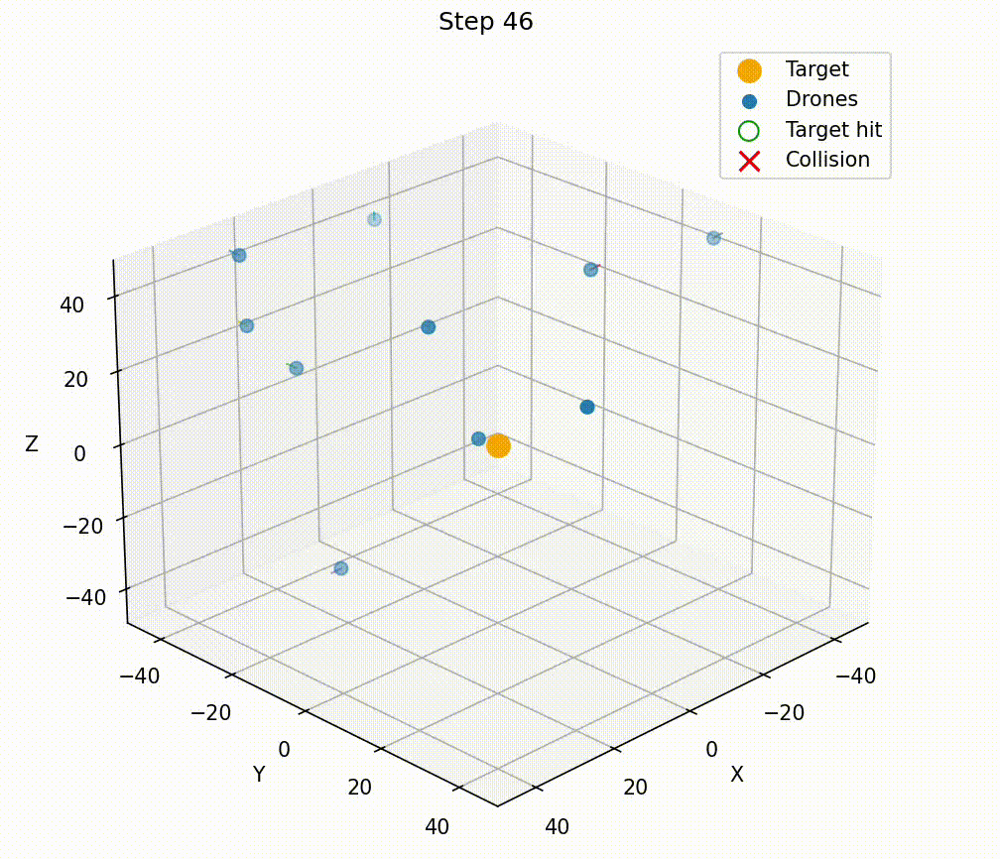

# Swarm Simulator

**Deterministic swarm simulation framework for developing, testing, and deploying swarm control algorithms.**

This project provides a high-performance, deterministic physics simulator paired with gRPC-based controllers. <br>
Enabling reproducible experiments for reinforcement learning, control research, and deployment-oriented swarm systems.

<p align="left">
  
</p>

PyTorch-based PPO reinforcement learning controlling a multi-drone swarm in the Rust simulator.

---

## Key Features

- Deterministic physics simulation for reproducible training and evaluation
- Scales to large swarms using an ECS (Entity Component System) architecture
- Language-agnostic control interface via gRPC (Rust, Python, C++)
- Clear separation of training and deployment workflows
- Binary logging and visualization tools for analysis and debugging

---

## Architecture Overview

**Core components:**

- **Simulator Server (Rust)**  
  High-performance deterministic physics engine and event logger.

- **Swarm Controller (Python, RL-focused)**  
  A PyTorch deep learning training controller (PPO: Proximal Policy Optimization).

- **Deployment Controller Example (C++)**  
  Production-style inference client demonstrating how trained policies can be deployed without Python dependencies.

- **gRPC / Protobuf Interface**  
  Bidirectional streaming API shared across training and deployment. Lockstep simulation.

- **Log Decoder & Visualization Tools (Python)**  
  Offline analysis, 3D animation and CSV export from binary logs.

---

## Simulator Server (Rust)

- Deterministic physics simulator designed for swarm control research/development
- ECS-based architecture for cache efficiency and scalability
- Spatial grid optimization for high performance collision detection (Drone - Drone, Drone - Target)
- Binary logging of:
  - Drone state
  - Collision events
- Reward calculation module for RL 
- Yaml config file configurable (World & drone physical settings), the controllers set amount of drones etc. on gRPC reset request.

This component is the authoritative simulation source used by all controllers.

---

## Swarm Controller (Python, Deep Learning Reinforcement Learning)

This component is intended for:
- Training swarm controllers using reinforcement learning
- Controller implements deep learning using PPO algorithm (Proximal Policy Optimization)
- Step-synchronized (lockstep) interaction with the simulator over gRPC

### PPO Implementation Overview
This project implements a **minimal, transparent PPO-style reinforcement learning loop** for swarm control.  
It is intentionally designed as a **scaffold for experimentation**, not a full-featured RL framework.
PPO: a reinforcement learning algorithm that improves a policy using gradient updates while preventing overly large changes that could destabilize learning. It does this by clipping the policy update so the new policy stays close to the old one, balancing learning speed and stability.

- **Actor–critic architecture** with separate policy and value networks.
- **Multi-drone friendly**:
  - Each drone is treated as an independent sample.
  - Alive masking ensures dead drones do not affect learning.
- **Continuous control**:
  - Gaussian policy in unconstrained space.
  - `tanh` squashing with proper log-probability correction.
- **Stability-focused engineering**:
  - PPO clipped objective
  - 1-step TD advantage (no GAE)
  - Advantage normalization
  - Value target clamping
  - Entropy bonus for exploration
  - Action saturation penalty to discourage boundary banging
- **Simple rollout collection**:
  - Periodic PPO updates using minibatches.
  - Multiple optimization epochs per rollout.
- **Philosophy**:
  - Prioritizes **clarity, debuggability, and control** over abstraction or performance.
  - Avoids heavy RL frameworks and hidden magic.
  - Well-suited for **research, prototyping, and swarm-specific RL experiments** tightly coupled to the simulator.

---

## Deployment Controller Example (C++)

An example of a **production-style inference client** that:

- Loads trained policies
- Controls the swarm through the same gRPC API as training
- Runs without Python dependencies

This demonstrates how learned policies can be deployed to:
- Embedded systems
- Robotics platforms
- Large-scale evaluation or simulation clusters

---

## gRPC Communication

- Protobuf-defined API shared across all languages
- Bidirectional streaming
- Lockstep simulation support for reinforcement learning

This design ensures training and deployment use **identical interfaces**, reducing sim-to-prod gaps.

---

## Log Decoder & Visualization

- Binary simulation logs for performance and determinism
- Tools for:
  - 3D animation playback
  - CSV export for analysis and plotting

---

## Getting Started

### Quick Run

To build and run rust server + python RL controller:

```bash
./run_sim.sh
```

This will update protobuf bindings for both simulator and the controller. 

---

## Manual Build & Run

### Simulation Server (Rust)

**Dependencies**
```bash
sudo apt install protobuf-compiler
```

**Build & Run**
```bash
cd sim_server
cargo build --release
cd - >/dev/null
sim_server/target/release/sim_server --config sim_server/configs/sim.yaml
```

---

### Swarm Controller (Python)

Generate Python gRPC bindings:

```bash
python -m grpc_tools.protoc \
  -I ../../proto \
  --python_out=. \
  --grpc_python_out=. \
  ../../proto/swarm.proto
```

---

### Swarm Controller Example (C++)

```bash
cd swarms/swarm_cpp
mkdir build && cd build
mkdir proto
cmake ..
make
./swarm
```

**Dependencies**
```bash
sudo apt install protobuf-compiler libgrpc++-dev
sudo apt install protobuf-compiler-grpc
```

#### Updating Protobuf Bindings

```bash
protoc \
  --proto_path=proto \
  --cpp_out=swarms/swarm_cpp/build/proto \
  --grpc_out=swarms/swarm_cpp/build/proto \
  --plugin=protoc-gen-grpc=$(which grpc_cpp_plugin) \
  proto/swarm.proto
```

---

## Visualization & Analysis

### 3D Animation

Given log files:
```
logs/00001_states.bin
logs/00001_events.bin
```

Run:
```bash
python tools/plot_swarm.py logs/00001
```

### Convert Logs to CSV

```bash
python tools/bin_to_csv.py logs/00001
```

---

## Use Cases

- Swarm robotics research
- Reinforcement learning experimentation
- Deterministic multi-drone benchmarking
- Deployment-oriented controller evaluation

---

## Roadmap, Future Work

- Default simulator controllers for dummy swarms (targets)
- Save weights after training in Python controller
- Update C++ controller to use saved weights
- Addition of GAE to PPO algorithm
- Enable 3d animation to show intended collisions as green triangles.

---


## License

Apache License Version 2.0