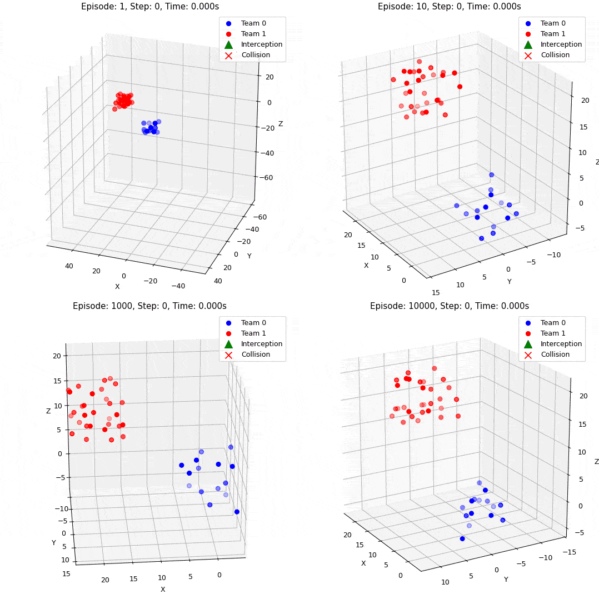
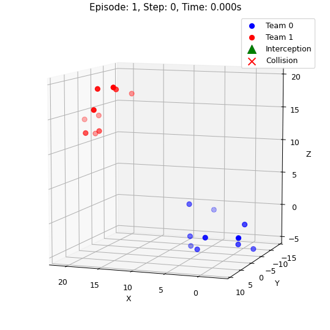

# Swarm Sim

**Deterministic swarm simulation framework for developing, testing, and deploying swarm control algorithms.**

This project provides a high-performance, deterministic physics simulator (Rust) paired with gRPC-based controllers (Python-PyTorch, C++).
Enabling reproducible experiments for reinforcement learning, control research, and deployment-oriented swarm systems.

<p align="left">
  
</p>

**Above**: PyTorch-based PPO reinforcement learning controlling a multi-drone swarm in the Rust simulator. <br>
Learned policy: Collision-aware decentralized intercept logic using only local observations. <br>
**Below**: The learned policy deployed in a C++ controller using LibTorch.
<p align="left">
  
</p>

---

## Key Features

- Deterministic physics simulation for reproducible training and evaluation
- Scales to large swarms using an ECS (Entity Component System) architecture
- Language-agnostic control interface via gRPC (Rust, Python, C++)
- Clear separation of training and deployment workflows
- Binary logging and visualization tools for analysis and debugging

---

## Architecture Overview

**Core components:**

- **Simulator Server (Rust)**  
  High-performance deterministic physics engine and event logger.

- **Swarm Controller (Python, PyTorch - Reinforcement Learning)**  
  A deep learning training controller (PPO: Proximal Policy Optimization).

- **Swarm Controller (C++, LibTorch - Deployment Example)**  
  Production-style inference client demonstrating how trained policies can be deployed without Python dependencies.

- **gRPC / Protobuf Interface**  
  Bidirectional streaming API shared across training and deployment. Lockstep simulation.

- **Log Decoder & Visualization Tools (Python)**  
  Offline analysis, 3D animation and CSV export from binary logs.

---

## Simulator Server (Rust)

- Deterministic physics simulator designed for swarm control research/development <br>(Simplified Physics, modify for your needs)
- ECS-based architecture for cache efficiency and scalability
- Spatial grid optimization for high performance collision detection (Drone - Drone, Drone - Target)
- Binary logging of:
  - Drone state
  - Collision events
- Reward & observation calculation modules for RL (Modify for your needs) 
- Yaml config file configurable (World & drone physical settings), the controllers set amount of drones etc. on gRPC reset request.
- Profiling (flamegraph)

This component is the authoritative simulation source used by all controllers.

---

## Swarm Controller (Python, PyTorch - Deep Learning Reinforcement Learning)

- Training swarm controller using reinforcement learning
- Controller implements deep learning using PPO algorithm (Proximal Policy Optimization)
- Step-synchronized (lockstep) interaction with the simulator over gRPC

### PPO Implementation Overview
Implements a minimal, transparent PPO-style reinforcement learning loop for swarm control. <br> PPO: A reinforcement learning algorithm that updates a policy with gradients while clipping changes to keep the new policy close to the old one, balancing learning speed and stability.

<p align="left">
  
</p>

- **Actor–critic architecture** with separate policy and value networks.
- **Multi-drone friendly**:
  - Each drone is treated as an independent sample.
  - Alive masking ensures dead drones do not affect learning.
- **Continuous control**:
  - Gaussian policy in unconstrained space.
  - `tanh` squashing with proper log-probability correction.
- **Stability-focused engineering**:
  - PPO clipped objective
  - 1-step TD advantage (no GAE)
  - Advantage normalization
  - Value target clamping
  - Entropy bonus for exploration
  - Action saturation penalty to discourage boundary banging
- **Simple rollout collection**:
  - Periodic PPO updates using minibatches.
  - Multiple optimization epochs per rollout.
- **Philosophy**:
  - Prioritizes **clarity, debuggability, and control** over abstraction or performance.
  - Avoids heavy RL frameworks and hidden magic.
  - Well-suited for **research, prototyping, and swarm-specific RL experiments** tightly coupled to the simulator.

---

## Swarm Controller (C++, LibTorch - Deployment Controller Example)

An example of a **production-style inference client** that:

- Loads trained policies
- Controls the swarm through the same gRPC API as training
- Runs without Python dependencies

This demonstrates how learned policies can be deployed to:
- Embedded systems
- Robotics platforms
- Large-scale evaluation or simulation clusters

---

## gRPC Communication

- Protobuf-defined API shared across all languages
- Bidirectional streaming
- Lockstep simulation support for reinforcement learning

This design ensures training and deployment use **identical interfaces**, reducing sim-to-prod gaps.

---

## Log Decoder & Visualization

- Binary simulation logs for performance and determinism
- Tools for:
  - 3D animation playback
  - CSV export for analysis and plotting

---

## Getting Started

### Quick Run

To build and run rust server + either python RL or c++ controller:

```bash
./run_sim.sh
```

This will update protobuf bindings for both simulator and the controller. 
Edit 'controller' in run_sim.sh to select controller. 

---

## How to Build and Run Components

This guide explains how to build and run each component of the system separately.  

- Rust simulator (gRPC server)
- C++ swarm controller (gRPC client)
- Python swarm controller (gRPC client)
- Shared protobuf definitions

---

## Rust Simulator

### Dependencies

- Rust (latest stable)
- Cargo
- Protobuf compiler (`protoc`)

### Build

```bash
cd sim_server
cargo build --release
cd - >/dev/null
```

### Run

```bash
sim_server/target/release/sim_server --config sim_server/configs/sim.yaml
```

---

## Python Controller

### Dependencies

- Python 3.8+
- virtualenv
- grpcio
- grpcio-tools
- PyTorch (This project used CPU version)

### Generate gRPC Code

```bash
cd swarms/swarm_py
python -m grpc_tools.protoc   -I ../../proto   --python_out=.   --grpc_python_out=.   ../../proto/swarm.proto
```

### Run

```bash
python train.py
```

---

## C++ Controller

### Dependencies

- CMake (>= 3.10)
- g++
- Protobuf
- gRPC
- grpc_cpp_plugin (must be in PATH)
- Libtorch (Same version as PyTorch version used in Python Controller)

### Generate gRPC Code

```bash
PROTO_SRC="proto"
OUT_DIR="swarms/swarm_cpp/build/proto"
mkdir -p "$OUT_DIR"
protoc   -I"$PROTO_SRC"   --cpp_out="$OUT_DIR"   --grpc_out="$OUT_DIR"   --plugin=protoc-gen-grpc=$(which grpc_cpp_plugin)   "$PROTO_SRC/swarm.proto"
```

### Build

```bash
cd swarms/swarm_cpp
rm -rf build
mkdir build
cd build
cmake ..
cmake --build . -- -j$(nproc)
cd ../../..
```

### Run

```bash
./swarms/swarm_cpp/build/swarm
```


---

## Visualization & Analysis

### 3D Animation

Given log files:
```
logs/00001_states.bin
logs/00001_events.bin
```

Run:
```bash
python tools/plot_swarm.py logs/00001
```

### Convert Logs to CSV

```bash
python tools/bin_to_csv.py logs/00001
```

---

## Use Cases

- Swarm robotics research
- Reinforcement learning experimentation
- Deterministic multi-drone benchmarking
- Deployment-oriented controller evaluation

---

## Possible Future Work

- Simulator: Move over to shared memory instead of gRPC communication
- Simulator: Add timeouts to catch faulty controllers breaking mid step
- Python PPO: Add GAE to PPO algorithm
- Python PPO: Enable loading of previosly saved policies

---

## License

Apache License Version 2.0